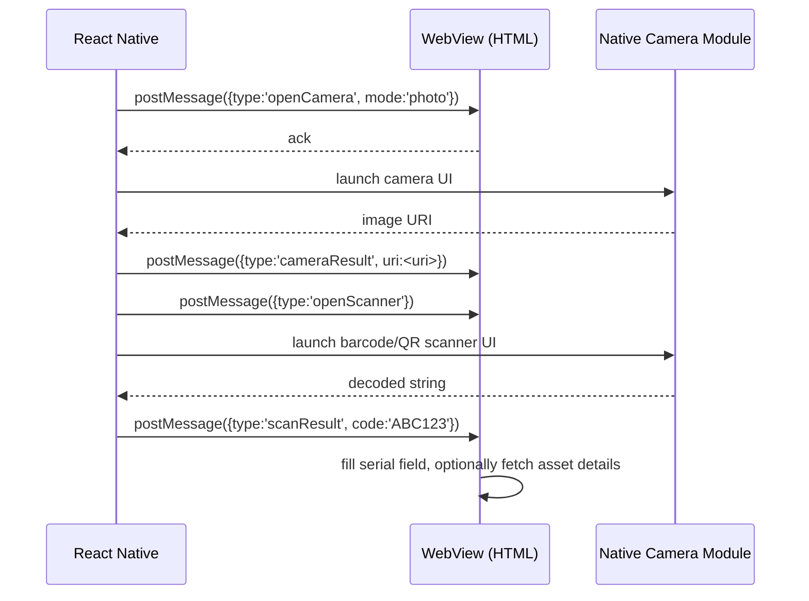

# AssetTracker – Full Project Specification

## 1. Overview
AssetTracker is a **mobile‑first asset‑management solution** built with a **React‑Native** wrapper that loads static HTML screens (stored in `projectscreens.txt`) inside a WebView. A **Laravel** backend (`AssetTrackerAPI`) supplies a REST API for asset CRUD, checkout handling, activity logging, and authentication via JWT.

The app targets a single **Asset Manager** role initially, with future plans for multiple roles, offline support, real‑time sync, and barcode/QR scanning to speed up asset identification and verification.

---
## 2. Architecture Diagram (Mermaid)
```mermaid
flowchart TD
    subgraph RN[React Native Wrapper]
        A[WebView] --> B[HTML Screens (projectscreens.txt)]
        A --> C[Native Camera Module]
    end
    subgraph API[Laravel API]
        D[AssetController] --> E[MySQL DB]
        F[CheckOutController]
    end
    B -->|fetch| D
    C -->|postMessage| B
    B -->|postMessage| C
    D -->|returns JSON| B
    style RN fill:#e0f7fa,stroke:#006064
    style API fill:#fff3e0,stroke:#bf360c
```
---
## 3. Design System (Tailwind)
The Tailwind configuration is embedded in `projectscreens.txt` (lines 12‑102). Key tokens:
- **Colors**: Primary `#004ac6`, Secondary `#1d4ed8`, Surface `#faf8ff`, Error `#ba1a1a`, plus a full suite of surface‑container variants for dark/light modes.
- **Typography**: Google Font **Inter** with sizes `label‑lg` (12 px), `title‑lg` (18 px), `headline‑md` (24 px), `display‑lg` (32 px).
- **Spacing**: `stack-sm` 8 px, `stack-md` 16 px, `container‑padding‑mobile` 16 px, `container‑padding‑desktop` 24 px.
- **Border radius**: `DEFAULT` 0.25 rem, `lg` 0.5 rem, `xl` 0.75 rem, `full` 9999 px.
- **Dark mode** enabled via `class` – toggling the `dark` class on `<html>` switches palettes.

---
## 4. Screens & Views (extracted from `projectscreens.txt`)
The file contains **six main screens** (identified by HTML comments). Each screen is a self‑contained HTML document rendered inside the WebView.

### 4.1 Archived Assets (Dashboard & Asset List)
- **Comment marker**: `<!-- Archived Assets -->` (lines 1‑317).
- **Purpose**: Shows a summary of total, damaged, expired assets and a searchable grid of archived assets.
- **Key UI components**: TopAppBar, search input, asset cards with restore button, bottom navigation.
- **Navigation**: FAB (+) opens **Register Asset**.

### 4.2 Register Asset
- **Comment marker**: `<!-- Register Asset -->` (lines 319‑574).
- **Purpose**: Multi‑step form for creating a new asset, including photo capture.
- **Camera integration**: Pressing the photo area sends `postMessage({type:'openCamera'})` to the native bridge; the returned image URI is displayed and attached to the form.
- **QR‑scan integration**: A **Scan** button sends `postMessage({type:'openScanner'})`; the scanned code is received via `scanResult` and auto‑populates the **Serial** field. If the code matches an existing asset, the rest of the form is pre‑filled.

### 4.3 Asset Check‑Out
- **Comment marker**: `<!-- Check‑Out Asset -->` (lines 658‑800).
- **Purpose**: Assign an asset to a person/location with an expected return date.
- **QR‑scan integration**: Same `openScanner` flow; the scanned code fills the asset selector automatically.

### 4.4 Activity Log
- Placeholder for chronological activity feed (API `GET /api/activity`).

### 4.5 Settings / More
- Stub for future settings, role management.

### 4.6 Loading / Splash Screen (Lines 5745‑5792)
- Progress bar with status cycling (`Connecting to Cloud`, `Syncing Local Assets`, `Optimizing Scanner`, `Ready`).
- Subtle logo movement on mouse move for a premium feel.

---
## 5. Camera & QR‑Code Scanning Integration
### 5.1 Native Bridge Flow


### 5.2 HTML Message Listeners (present in Register & Check‑Out screens)
```javascript
window.addEventListener('message', e => {
  const data = JSON.parse(e.data);
  if (data.type === 'cameraResult') {
    document.querySelector('#photoPreview').src = data.uri;
  }
  if (data.type === 'scanResult') {
    const serial = document.getElementById('serial');
    serial.value = data.code;
    // Auto‑populate if asset exists
    fetch(`/api/assets?code=${data.code}`)
      .then(r => r.json())
      .then(fillForm)
      .catch(() => {/* no asset – user can create new */});
  }
});
```
---
## 5.3 **Verification Use‑Case – Detecting Swapped Assets**
1. User views an asset detail screen.
2. Press **“Verify QR Code”** button → native scanner (`openScanner`).
3. Scanned code returned via `scanResult`.
4. App fetches asset linked to that code (`GET /api/assets?code=XYZ`).
5. **If IDs match** → success toast *“Asset verified – QR code matches.”*.
6. **If IDs differ** → warning modal:
   - Message: *“The scanned QR code belongs to a different asset (Asset #123). This may indicate a swap.”*
   - Options: **Report Issue**, **Ignore**, **Open the other asset**.
7. Backend logs the event (`POST /api/activity` with type `verification_mismatch`).

### Benefits
- Guarantees physical‑digital integrity.
- Provides an audit trail for accidental or malicious swaps.
- Enables quick resolution (open correct asset, notify staff).

---
## 6. Navigation Flow (End‑to‑End)
1. Splash → Dashboard
2. Dashboard → Asset List (bottom nav)
3. Asset List → Register Asset (FAB) or → Asset Detail (tap card)
4. Asset Detail → **Verify QR Code** (button) → Camera → verification outcome.
5. Register Asset / Check‑Out → optional Scan → submit → Dashboard.
6. Dashboard → Activity Log / Settings (bottom nav).

---
## 7. API Contract Summary
| Endpoint | Method | Body | Response | Description |
|----------|--------|------|----------|-------------|
| `/api/summary` | GET | – | `{total, damaged, expired, checked_out}` | Dashboard stats |
| `/api/assets` | GET | `?archived=true` or `?code=XYZ` | `[Asset]` or single `Asset` | List or lookup |
| `/api/assets` | POST | `multipart/form-data` (photo + fields) | `Asset` (201) | Create asset |
| `/api/assets/{id}` | PATCH | `{status:'active'}` | `Asset` | Restore archived |
| `/api/checkouts` | POST | `{asset_id, assignee, purpose, expected_return}` | `CheckOut` (201) | Checkout |
| `/api/activity` | GET | – | `[LogEntry]` | Activity feed |
| `/api/activity` | POST | `{type, details}` | `LogEntry` (201) | Log verification mismatches |
| `/api/auth/login` | POST | `{email,password}` | `{token}` | JWT auth |
All requests need `Authorization: Bearer <jwt>`.
---
## 8. Error Handling & Edge Cases
- Network failures → toast *“Unable to reach server, retry?”*.
- Validation errors → inline messages, disabled submit.
- Duplicate serial on Register → 409 Conflict → *“Asset already exists.”*
- Checkout on already‑checked‑out asset → 400 Bad Request → *“Asset already checked out.”*
- Scan cancelled → toast *“Scan cancelled.”*.
- **QR verification mismatch** → warning modal, log event.
- Expired JWT → 401 → redirect to login.
---
## 9. Non‑Functional Requirements
- **Performance**: < 2 s initial load on 4G.
- **Responsiveness**: Tailwind breakpoints for phones/tablets.
- **Accessibility**: Semantic HTML, ARIA labels, sufficient contrast.
- **Security**: JWT in SecureStore, HTTPS only.
- **Scalability**: Pagination ready, Docker‑able.
- **Maintainability**: Central Tailwind config, component‑based HTML, clear RN‑Laravel separation.
---
## 10. Future Roadmap
1. Role‑Based Access Control.
2. Real‑Time Sync via WebSockets.
3. Enhanced scanning (batch, QR with metadata).
4. Bulk import/export (CSV).
5. Offline mode (AsyncStorage cache).
6. Internationalisation.
7. Testing suite (Jest, Cypress).
---
## 11. Appendix – Key File Locations
- **HTML Screens**: `AssetTracker/projectscreens.txt`
- **React Native Wrapper**: `AssetTracker/App.js`
- **Laravel Backend**: `AssetTrackerAPI/` (routes, controllers, models)
- **Design Tokens**: Inline Tailwind config (lines 12‑102 of `projectscreens.txt`)
- **Full Spec** (this file): `AssetTracker/PROJECT_FULL_SPEC.md`
---
*The document now includes the QR‑verification use case to ensure assets cannot be silently swapped without detection.*


# AssetTracker – Full Project Specification

## 1. Overview
AssetTracker is a **mobile‑first asset‑management solution** built with a **React‑Native** wrapper that loads static HTML screens (stored in `projectscreens.txt`) inside a WebView. A **Laravel** backend (`AssetTrackerAPI`) supplies a REST API for asset CRUD, checkout handling, activity logging, and authentication via JWT.

The app targets a single **Asset Manager** role initially, with future plans for multiple roles, offline support, real‑time sync, and barcode/QR scanning to speed up asset identification and verification.

---
## 2. Architecture Diagram (Mermaid)
```mermaid
flowchart TD
    subgraph RN[React Native Wrapper]
        A[WebView] --> B[HTML Screens (projectscreens.txt)]
        A --> C[Native Camera Module]
    end
    subgraph API[Laravel API]
        D[AssetController] --> E[MySQL DB]
        F[CheckOutController]
    end
    B -->|fetch| D
    C -->|postMessage| B
    B -->|postMessage| C
    D -->|returns JSON| B
    style RN fill:#e0f7fa,stroke:#006064
    style API fill:#fff3e0,stroke:#bf360c
```
---
## 3. Design System (Tailwind)
The Tailwind configuration is embedded in `projectscreens.txt` (lines 12‑102). Key tokens:
- **Colors**: Primary `#004ac6`, Secondary `#1d4ed8`, Surface `#faf8ff`, Error `#ba1a1a`, plus a full suite of surface‑container variants for dark/light modes.
- **Typography**: Google Font **Inter** with sizes `label‑lg` (12 px), `title‑lg` (18 px), `headline‑md` (24 px), `display‑lg` (32 px).
- **Spacing**: `stack-sm` 8 px, `stack-md` 16 px, `container‑padding‑mobile` 16 px, `container‑padding‑desktop` 24 px.
- **Border radius**: `DEFAULT` 0.25 rem, `lg` 0.5 rem, `xl` 0.75 rem, `full` 9999 px.
- **Dark mode** enabled via `class` – toggling the `dark` class on `<html>` switches palettes.

---
## 4. Screens & Views (extracted from `projectscreens.txt`)
The file contains **six main screens** (identified by HTML comments). Each screen is a self‑contained HTML document rendered inside the WebView.

### 4.1 Archived Assets (Dashboard & Asset List)
- **Comment marker**: `<!-- Archived Assets -->` (lines 1‑317).
- **Purpose**: Shows a summary of total, damaged, expired assets and a searchable grid of archived assets.
- **Key UI components**: TopAppBar, search input, asset cards with restore button, bottom navigation.
- **Navigation**: FAB (+) opens **Register Asset**.

### 4.2 Register Asset
- **Comment marker**: `<!-- Register Asset -->` (lines 319‑574).
- **Purpose**: Multi‑step form for creating a new asset, including photo capture.
- **Camera integration**: Pressing the photo area sends `postMessage({type:'openCamera'})` to the native bridge; the returned image URI is displayed and attached to the form.
- **QR‑scan integration**: A **Scan** button sends `postMessage({type:'openScanner'})`; the scanned code is received via `scanResult` and auto‑populates the **Serial** field. If the code matches an existing asset, the rest of the form is pre‑filled.

### 4.3 Asset Check‑Out
- **Comment marker**: `<!-- Check‑Out Asset -->` (lines 658‑800).
- **Purpose**: Assign an asset to a person/location with an expected return date.
- **QR‑scan integration**: Same `openScanner` flow; the scanned code fills the asset selector automatically.

### 4.4 Activity Log
- Placeholder for chronological activity feed (API `GET /api/activity`).

### 4.5 Settings / More
- Stub for future settings, role management.

### 4.6 Loading / Splash Screen (Lines 5745‑5792)
- Progress bar with status cycling (`Connecting to Cloud`, `Syncing Local Assets`, `Optimizing Scanner`, `Ready`).
- Subtle logo movement on mouse move for a premium feel.

---
## 5. Camera & QR‑Code Scanning Integration
### 5.1 Native Bridge Flow


### 5.2 HTML Message Listeners (present in Register & Check‑Out screens)
```javascript
window.addEventListener('message', e => {
  const data = JSON.parse(e.data);
  if (data.type === 'cameraResult') {
    document.querySelector('#photoPreview').src = data.uri;
  }
  if (data.type === 'scanResult') {
    const serial = document.getElementById('serial');
    serial.value = data.code;
    // Auto‑populate if asset exists
    fetch(`/api/assets?code=${data.code}`)
      .then(r => r.json())
      .then(fillForm)
      .catch(() => {/* no asset – user can create new */});
  }
});
```
---
## 5.3 **Verification Use‑Case – Detecting Swapped Assets**
1. User views an asset detail screen.
2. Press **“Verify QR Code”** button → native scanner (`openScanner`).
3. Scanned code returned via `scanResult`.
4. App fetches asset linked to that code (`GET /api/assets?code=XYZ`).
5. **If IDs match** → success toast *“Asset verified – QR code matches.”*.
6. **If IDs differ** → warning modal:
   - Message: *“The scanned QR code belongs to a different asset (Asset #123). This may indicate a swap.”*
   - Options: **Report Issue**, **Ignore**, **Open the other asset**.
7. Backend logs the event (`POST /api/activity` with type `verification_mismatch`).

### Benefits
- Guarantees physical‑digital integrity.
- Provides an audit trail for accidental or malicious swaps.
- Enables quick resolution (open correct asset, notify staff).

---
## 6. Navigation Flow (End‑to‑End)
1. Splash → Dashboard
2. Dashboard → Asset List (bottom nav)
3. Asset List → Register Asset (FAB) or → Asset Detail (tap card)
4. Asset Detail → **Verify QR Code** (button) → Camera → verification outcome.
5. Register Asset / Check‑Out → optional Scan → submit → Dashboard.
6. Dashboard → Activity Log / Settings (bottom nav).

---
## 7. API Contract Summary
| Endpoint | Method | Body | Response | Description |
|----------|--------|------|----------|-------------|
| `/api/summary` | GET | – | `{total, damaged, expired, checked_out}` | Dashboard stats |
| `/api/assets` | GET | `?archived=true` or `?code=XYZ` | `[Asset]` or single `Asset` | List or lookup |
| `/api/assets` | POST | `multipart/form-data` (photo + fields) | `Asset` (201) | Create asset |
| `/api/assets/{id}` | PATCH | `{status:'active'}` | `Asset` | Restore archived |
| `/api/checkouts` | POST | `{asset_id, assignee, purpose, expected_return}` | `CheckOut` (201) | Checkout |
| `/api/activity` | GET | – | `[LogEntry]` | Activity feed |
| `/api/activity` | POST | `{type, details}` | `LogEntry` (201) | Log verification mismatches |
| `/api/auth/login` | POST | `{email,password}` | `{token}` | JWT auth |
All requests need `Authorization: Bearer <jwt>`.
---
## 8. Error Handling & Edge Cases
- Network failures → toast *“Unable to reach server, retry?”*.
- Validation errors → inline messages, disabled submit.
- Duplicate serial on Register → 409 Conflict → *“Asset already exists.”*
- Checkout on already‑checked‑out asset → 400 Bad Request → *“Asset already checked out.”*
- Scan cancelled → toast *“Scan cancelled.”*.
- **QR verification mismatch** → warning modal, log event.
- Expired JWT → 401 → redirect to login.
---
## 9. Non‑Functional Requirements
- **Performance**: < 2 s initial load on 4G.
- **Responsiveness**: Tailwind breakpoints for phones/tablets.
- **Accessibility**: Semantic HTML, ARIA labels, sufficient contrast.
- **Security**: JWT in SecureStore, HTTPS only.
- **Scalability**: Pagination ready, Docker‑able.
- **Maintainability**: Central Tailwind config, component‑based HTML, clear RN‑Laravel separation.
---
## 10. Future Roadmap
1. Role‑Based Access Control.
2. Real‑Time Sync via WebSockets.
3. Enhanced scanning (batch, QR with metadata).
4. Bulk import/export (CSV).
5. Offline mode (AsyncStorage cache).
6. Internationalisation.
7. Testing suite (Jest, Cypress).
---
## 11. Appendix – Key File Locations
- **HTML Screens**: `AssetTracker/projectscreens.txt`
- **React Native Wrapper**: `AssetTracker/App.js`
- **Laravel Backend**: `AssetTrackerAPI/` (routes, controllers, models)
- **Design Tokens**: Inline Tailwind config (lines 12‑102 of `projectscreens.txt`)
- **Full Spec** (this file): `AssetTracker/PROJECT_FULL_SPEC.md`
---
*The document now includes the QR‑verification use case to ensure assets cannot be silently swapped without detection.*
